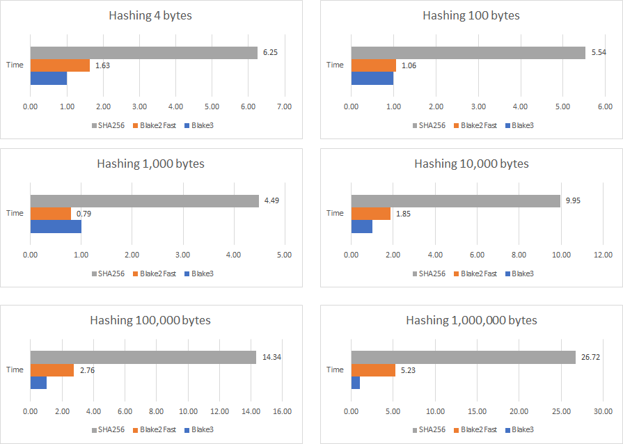

# Blake3.NET [](https://github.com/xoofx/Blake3.NET/actions) [](https://github.com/xoofx/Blake3.NET/actions) [](https://www.nuget.org/packages/Blake3/)


Blake3.NET is a fast managed wrapper around the SIMD Rust implementations of the [BLAKE3](https://github.com/BLAKE3-team/BLAKE3) cryptographic hash function.

> The current _native_ version of BLAKE3 used by Blake3.NET is `0.3.7`

## Usage

Hash directly a buffer:

```c#
var hash = Blake3.Hasher.Hash(Encoding.UTF8.GetBytes("BLAKE3"));
Console.WriteLine(hash);
// Prints f890484173e516bfd935ef3d22b912dc9738de38743993cfedf2c9473b3216a4
```

Or use the `Hasher` struct for incremental updates:

```c#
// Hasher is a disposable struct!
using var hasher = Blake3.Hasher.New();
hasher.Update(Encoding.UTF8.GetBytes("BLAKE3"));
var hash = hasher.Finalize();
```

Or hash a stream on the go with `Blake3Stream`:

```c#
using var blake3Stream = new Blake3Stream(new MemoryStream());
blake3Stream.Write(Encoding.UTF8.GetBytes("BLAKE3"));
var hash = blake3Stream.ComputeHash();
```
## Platforms

Blake3.NET is supporting **.NET 5.0+** on the following platforms:

- Windows x64
- Windows x86
- Windows ARM64
- Windows ARM
- Linux x64
- Linux ARM64
- Linux ARM
- OSX x64

## Benchmarks

The benchmarks are running with [BenchmarkDotNet](https://github.com/dotnet/BenchmarkDotNet/) .NET 5.0 and done on multiple different sizes compared with the following implementations:

- Blake3.NET (Blake3 Native Version: `0.3.7`)
- [Blake2Fast](https://github.com/saucecontrol/Blake2Fast) `2.0.0`
- `System.Security.Cryptography.SHA256` of .NET 5.0

For the 1,000,000 bytes test, Blake3 is using the multi-threading version provided by Blake3 (`Hasher.UpdateWithJoin` method).

> **Results**
>
> - In general, Blake3 is faster. 
> - The multi-threading version can give a significant boost if the data to hash is big enough
> - There is a worst case around 1,000 bytes (that will probably require some investigation)



``` ini

BenchmarkDotNet=v0.12.1, OS=Windows 10.0.19041.630 (2004/?/20H1)
AMD Ryzen 9 3900X, 1 CPU, 24 logical and 12 physical cores
.NET Core SDK=5.0.100
  [Host]     : .NET Core 5.0 (CoreCLR 5.0.20.51904, CoreFX 5.0.20.51904), X64 RyuJIT
  DefaultJob : .NET Core 5.0.0 (CoreCLR 5.0.20.51904, CoreFX 5.0.20.51904), X64 RyuJIT


```
|     Method |       N |          Mean |        Error |       StdDev |
|----------- |-------- |--------------:|-------------:|-------------:|
|     **Blake3** |       **4** |      **77.86 ns** |     **0.332 ns** |     **0.310 ns** |
| Blake2Fast |       4 |     123.57 ns |     0.939 ns |     0.879 ns |
|     SHA256 |       4 |     244.31 ns |     1.157 ns |     1.082 ns |
|     **Blake3** |     **100** |     **125.60 ns** |     **0.497 ns** |     **0.440 ns** |
| Blake2Fast |     100 |     124.48 ns |     1.053 ns |     0.985 ns |
|     SHA256 |     100 |     279.82 ns |     1.853 ns |     1.734 ns |
|     **Blake3** |    **1000** |     **888.90 ns** |     **0.873 ns** |     **0.681 ns** |
| Blake2Fast |    1000 |     790.85 ns |     4.364 ns |     3.645 ns |
|     SHA256 |    1000 |     700.81 ns |     2.078 ns |     1.842 ns |
|     **Blake3** |   **10000** |   **3,508.37 ns** |    **23.411 ns** |    **21.899 ns** |
| Blake2Fast |   10000 |   7,569.91 ns |    40.661 ns |    38.034 ns |
|     SHA256 |   10000 |   4,922.90 ns |    14.360 ns |    13.432 ns |
|     **Blake3** |  **100000** |  **22,109.48 ns** |    **47.699 ns** |    **39.830 ns** |
| Blake2Fast |  100000 |  75,937.97 ns |   223.972 ns |   209.503 ns |
|     SHA256 |  100000 |  48,655.78 ns |   102.273 ns |    95.666 ns |
|     **Blake3** | **1000000** | **117,936.94 ns** |   **263.454 ns** |   **246.435 ns** |
| Blake2Fast | 1000000 | 768,752.03 ns | 1,836.783 ns | 1,718.128 ns |
|     SHA256 | 1000000 | 485,944.26 ns | 1,326.657 ns | 1,240.956 ns |

## How to Build?

You need to install the [.NET 5 SDK](https://dotnet.microsoft.com/download/dotnet/5.0). Then from the root folder:

```console
$ dotnet build src -c Release
```

In order to rebuild the native binaries, you need to run the build scripts from [lib/blake3_dotnet](lib/blake3_dotnet/readme.md)

## License

This software is released under the [BSD-Clause 2 license](https://opensource.org/licenses/BSD-2-Clause).

## Author

Alexandre Mutel aka [xoofx](http://xoofx.com).
